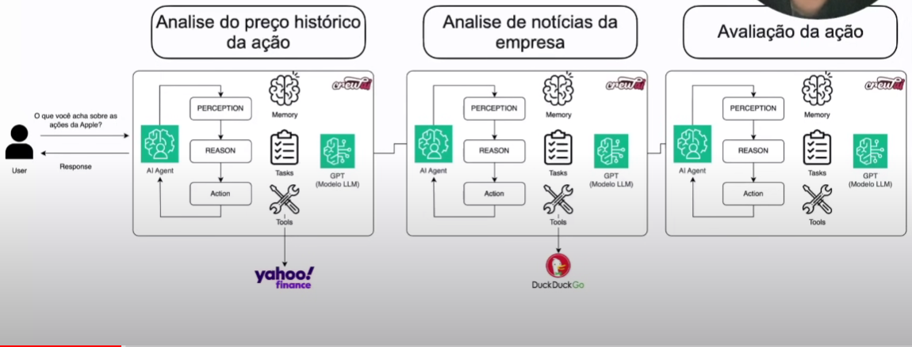

# Stock Analysis Automation with AI Agents

## Descrição

Este projeto utiliza agentes de IA para automatizar a análise de preços de ações e a geração de relatórios baseados em notícias do mercado. A aplicação busca o histórico de preços de ações usando a API do Yahoo Finance, analisa notícias relevantes e então compõe uma newsletter detalhada e persuasiva com previsões sobre a tendência das ações.

## O que são Agentes?

Agentes são entidades autônomas que desempenham tarefas específicas de maneira independente, utilizando ferramentas e seguindo objetivos pré-definidos. No contexto deste projeto, os agentes são responsáveis por processar e analisar informações relacionadas ao mercado financeiro e gerar relatórios detalhados.

## Visão Geral do Funcionamento

A imagem abaixo ilustra como os agentes interagem para realizar a análise completa de uma ação, desde a coleta de dados de preços históricos e notícias até a avaliação final:



## Agentes Criados

1. **Agente de Análise de Preços de Ações (`stockPriceAnalyst`):**
   - Função: Analisar o histórico de preços de uma ação específica e identificar tendências (alta, baixa ou lateral).
   - Ferramenta: Usa a API do Yahoo Finance para buscar dados de preços.

2. **Agente de Análise de Notícias de Mercado (`newsAnalyst`):**
   - Função: Coletar e analisar notícias de mercado relacionadas à ação e atribuir um índice de medo/ganância com base nas informações encontradas.
   - Ferramenta: Usa a ferramenta DuckDuckGo para buscar notícias.

3. **Agente de Escrita de Análises de Ações (`stockAnalystWrite`):**
   - Função: Compilar as análises de preços e notícias e escrever uma newsletter informativa e persuasiva sobre a ação.
   - Ferramenta: Usa os resultados dos outros dois agentes para gerar a análise final.

## Ordem de Execução dos Agentes

1. **Análise de Preços de Ações:** O primeiro agente (`stockPriceAnalyst`) busca o histórico de preços da ação e determina a tendência atual.
2. **Análise de Notícias:** O segundo agente (`newsAnalyst`) analisa as notícias de mercado relacionadas à ação e avalia o sentimento geral (medo/ganância).
3. **Geração de Relatório:** O terceiro agente (`stockAnalystWrite`) utiliza as informações coletadas pelos dois primeiros agentes para criar uma newsletter final.

## Deploy

Este projeto foi implementado no Streamlit e está disponível para uso público. Você pode acessá-lo através do seguinte link:

[https://agentsstockscrewai.streamlit.app/](https://agentsstockscrewai.streamlit.app/)

## Como Usar

1. Clone o repositório:
    ```bash
    git clone https://github.com/seu_usuario/stock-analysis-automation.git
    cd stock-analysis-automation
    ```

2. Instale as dependências:
    ```bash
    pip install -r requirements.txt
    ```

3. Execute a aplicação localmente com Streamlit:
    ```bash
    streamlit run app.py
    ```

4. Insira o ticker da ação que deseja pesquisar na barra lateral e clique em "Run Research".

## Licença

Este projeto está licenciado sob a licença MIT. Consulte o arquivo LICENSE para mais informações.

